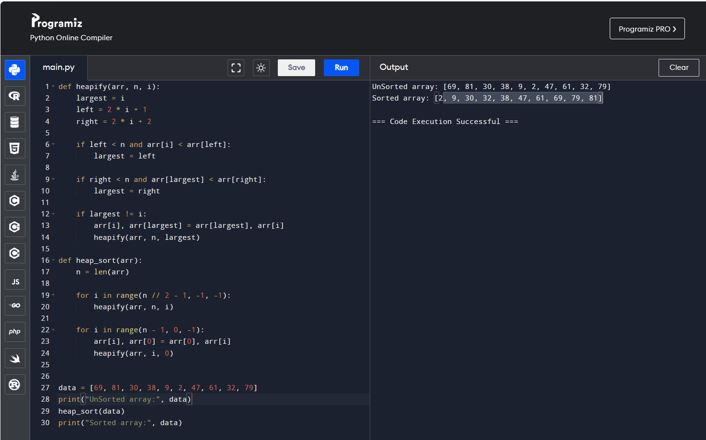

## GenAI_Algorithm_lab1 ==> 二元搜尋樹的各種實作(heap sort)
- `提問詞`:請寫出heap sort的演算法
- `提問詞`:請計算heap sort樹演算法的時間複雜度
- `提問詞`:請用Python寫出heap sort的演算法
- `提問詞`:請用C寫出heap sort的演算法
- `提問詞`:請用C++寫出heap sort的演算法
- `提問詞`:請用JAVA寫出heap sort的演算法
- `提問詞`:請用Rust寫出heap sort的演算法
- `提問詞`:請用go寫出heap sort的演算法
- `提問詞`:請用C#寫出heap sort的演算法
- `提問詞`:請用Javascript寫出二heap sort的演算法


### `提問詞`:請寫出heap sort的演算法
```
堆積排序（Heap Sort）是一種利用完全二元樹（也稱為堆積）來進行排序的演算法12。
讓我為您簡要介紹一下堆積排序的原理和實作步驟：

概念：
堆積排序使用最大堆積或最小堆積來排序。
最大堆積：父節點的值大於或等於子節點的值。
最小堆積：父節點的值小於或等於子節點的值。

步驟：
建立堆積：將待排序的陣列製作成最大堆積或最小堆積。
如果要遞增排序，使用最大堆積；如果要遞減排序，使用最小堆積。

排序：反覆從堆積中取出最大（或最小）值，並重新調整堆積，直到排序完成。

實作方式：
將待排序的陣列建立成堆積結構。
依序取出堆積的根節點（最大值或最小值），並調整堆積。
重複上述步驟，直到所有元素都被取出。
時間複雜度：
平均情況下：
𝑂(𝑛log𝑛)
O(nlogn)
最壞情況下：
𝑂(𝑛log𝑛)
O(nlogn)

以下是使用 Python 實現堆積排序的範例：

def heapify(arr, n, i):
    largest = i
    left = 2 * i + 1
    right = 2 * i + 2

    if left < n and arr[i] < arr[left]:
        largest = left

    if right < n and arr[largest] < arr[right]:
        largest = right

    if largest != i:
        arr[i], arr[largest] = arr[largest], arr[i]
        heapify(arr, n, largest)

def heap_sort(arr):
    n = len(arr)

    for i in range(n // 2 - 1, -1, -1):
        heapify(arr, n, i)

    for i in range(n - 1, 0, -1):
        arr[i], arr[0] = arr[0], arr[i]
        heapify(arr, i, 0)


data = [69, 81, 30, 38, 9, 2, 47, 61, 32, 79]
print("UnSorted array:", data)
heap_sort(data)
print("Sorted array:", data)

AI 產生的代碼。請仔細檢視及使用。
深入了解常見問題集。

輸出結果：

Sorted array: [2, 9, 30, 32, 38, 47, 61, 69, 79, 81]

這段程式碼展示了如何使用堆積排序將陣列遞增排序。
如果您需要更詳細的解釋或其他說明，請隨時告知！34
```
- Online Python Interpreter
  - [Online Python Compiler (Interpreter) - Programiz](https://www.programiz.com/python-programming/online-compiler/)
 

